# HowToCoffee

HowToCoffee is a coffee assistant that supports you in interacting with the ever-complex world of specialty coffee, from diagnosing your brew to discovering your taste to finding new coffees around the globe.

Target audience: specialty coffee drinkers and home baristas who want repeatable, better-tasting brews.

## Features
- Taste onboarding to capture preferences
- Diagnose brew flow with guided steps and suggestions
- Scan a coffee bag label with on-device text recognition
- Save recipes to a personal agenda
- Auth/profile flows and a simple marketplace entry point
- English and German localization

## Tech stack
- Expo + React Native (TypeScript)
- Expo Router for file-based navigation
- NativeWind (Tailwind) for styling
- i18next + react-i18next for localization
- AsyncStorage for local persistence
- ML Kit text recognition (bag scanning)

## Architecture
The codebase follows a feature-first, layered approach:
- `app/` contains Expo Router screens. Each screen wires UI to feature logic.
- `src/features/*` are isolated feature slices with `presentation`, `domain`, and `data` layers.
- `src/shared/*` holds reusable UI, domain models/use cases, services, config, and utilities.
- `src/i18n/` defines localization resources and initialization.

Architecture diagram:
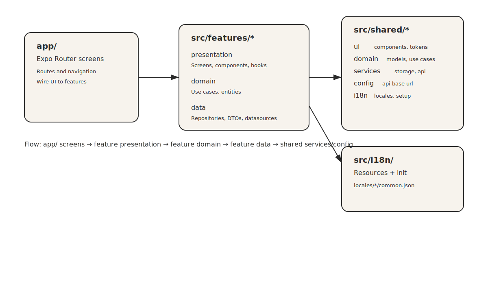

Data flow vs navigation diagram:
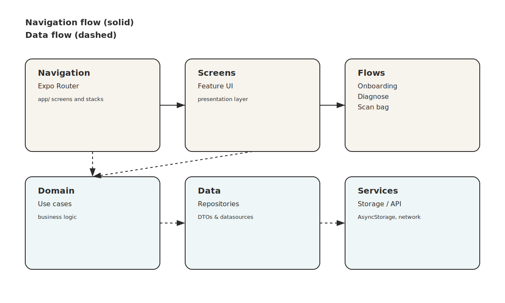

Typical flow:
1. A screen in `app/` renders a feature `presentation` component or hook.
2. The presentation layer calls feature `domain` use cases.
3. The domain layer uses `data` repositories/datasources.
4. Repositories use shared services (storage, API base URL, etc.).

## Dependency graph
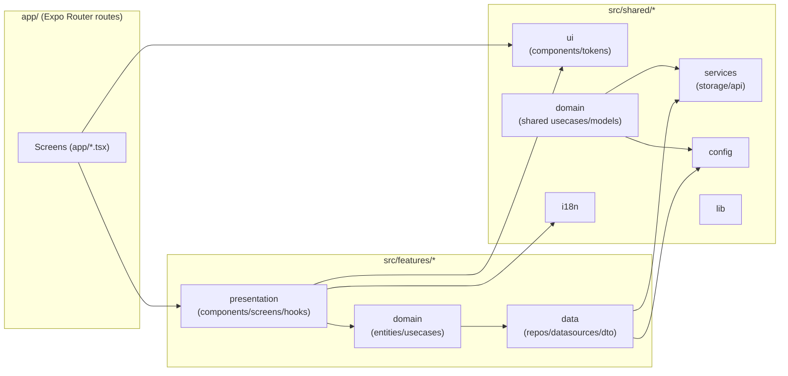

## Flow diagrams
Primary user flow:
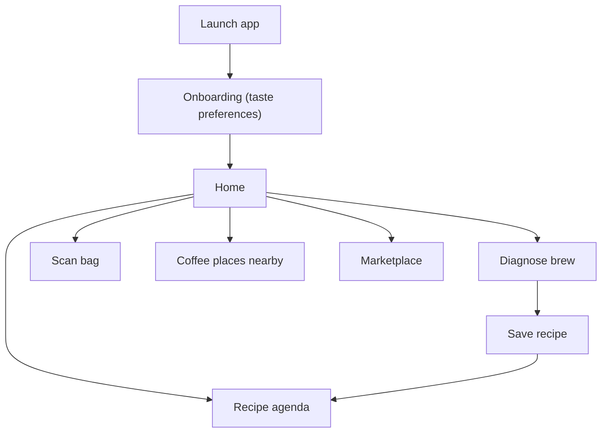

Diagnose brew flow:
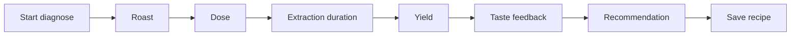

Onboarding flow:
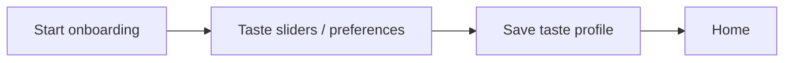

Scan bag flow:
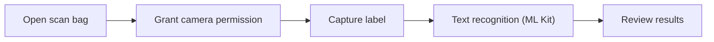

Recipe agenda flow:
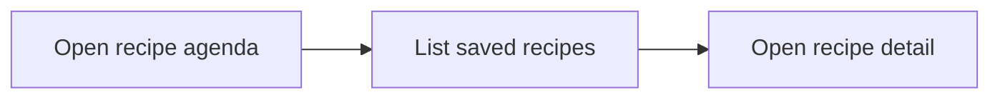

Coffee places nearby flow:
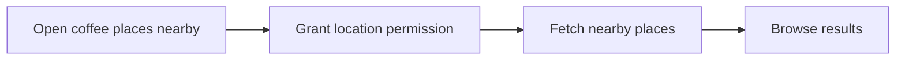

Marketplace flow:
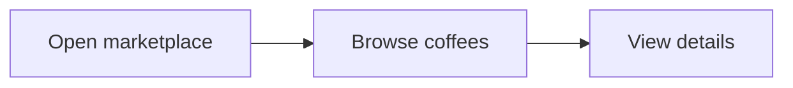

Auth/profile flow:
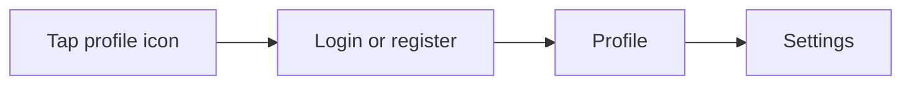

## Project structure
```
app/                      # Expo Router routes
src/
  features/               # Feature slices
  shared/                 # Shared UI, domain, services, config
  i18n/                   # Localization resources + setup
assets/                   # Fonts and images
```

## Getting started
```bash
npm install
npx expo start
```

## Environment and configuration
- Create `.env.local` to inject optional values used by `app.config.js`.
- Optional: `DEV_JWT` (development only). If provided, the home screen lets you inject it via a dev-only action.
- API base URL defaults are defined in `src/shared/config/config.ts`. You can switch between defaults or set a custom URL from the home screen (tap the title).

## APIs and integrations
- Custom backend API (base URL configurable at runtime)
- Google ML Kit Text Recognition (via `@react-native-ml-kit/text-recognition`)
- Device location (via `expo-location`)

Note: Bag scanning relies on a native module, so use a dev client or native build (not Expo Go).

## API documentation
See `docs/api.md`.

## Useful scripts
- `npm run start` — start Expo dev server
- `npm run android` / `npm run ios` — run native builds
- `npm run web` — run web build
- `npm run lint` — lint app and src
- `npm run test:diagnose` — feature tests for diagnose
- `npm run test:tastePrefs` — taste preferences store tests
- `npm run gen:i18n` — regenerate string keys from locale JSON

## Localization
- Resources live in `src/i18n/locales/*/common.json`.
- String keys are generated into `src/i18n/strings.ts` via `npm run gen:i18n`.

## Builds
- EAS build configuration lives in `eas.json`.

## License
Proprietary. All rights reserved. Copyright (c) 2026 Marius Stroescu.
